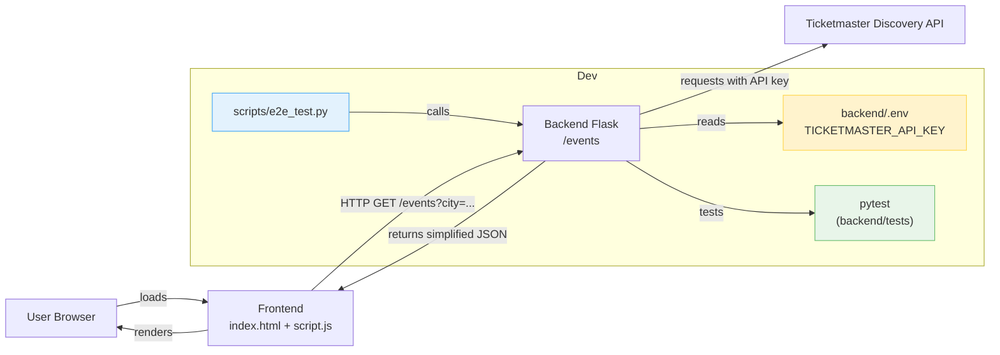

# GloboTicket

## Project Overview

- **Project name:** GloboTicket
- **Brief description:** A small two-tier demo application that lets users search for events by city. The frontend is a lightweight static UI (HTML/CSS/JavaScript) and the backend is a Python Flask service that proxies the Ticketmaster Discovery API and returns a simplified events list.
- **Purpose and key features:**
	- Demonstrate a secure backend proxy for a third-party events API (Ticketmaster).
	- Provide a minimal single-page frontend to query events by city and display results.
	- Include tests for backend behavior and simple end-to-end verification script.
- **Architecture overview:**
	- Frontend: static HTML/CSS/JS served from `frontend/` (can be served with a static server).
	- Backend: Flask app in `backend/app.py` that exposes `GET /events?city={city}` and calls Ticketmaster Discovery API.

### Architecture Diagram



The diagram shows the primary runtime flow: a user loads the static frontend which calls the backend `GET /events` endpoint. The backend reads the `TICKETMASTER_API_KEY` from environment, queries Ticketmaster, maps the response to a small JSON payload, and returns it for the frontend to render. Development helpers include unit tests and a simple end-to-end script.

## Technology Stack

- **Frontend:** Plain HTML, CSS, and vanilla JavaScript (no build tool).
- **Backend:** Python 3 + Flask. Uses `requests`, `python-dotenv`, and `flask-cors`.
- **Database(s):** None (in-memory, no persistence).
- **Authentication/Authorization:** None for users. The app requires a Ticketmaster API key (kept secret on the backend).
- **Third-party services / integrations:** Ticketmaster Discovery API (events.json).
- **Testing frameworks/tools:** `pytest` for backend unit tests; a small Python script `scripts/e2e_test.py` for a manual end-to-end smoke test.
- **DevOps / CI-CD:** None included in the repository.

## Project Structure

Top-level layout:

```
GloboTicketApp/
├─ backend/
│  ├─ app.py                 # Flask app (GET /events)
│  ├─ requirements.txt       # Python dependencies
	│  ├─ .env.example         # Example env vars
	│  └─ tests/test_app.py    # pytest tests for backend
├─ frontend/
│  ├─ index.html             # Single-page frontend
│  ├─ script.js              # Fetches /events and renders results
│  └─ styles.css             # Simple styles
├─ scripts/
│  └─ e2e_test.py            # Small script to query the running backend
└─ README.md                 # This file
```

### Purpose of major directories and files

- `backend/`: contains the Flask API proxy and tests.
- `frontend/`: static UI that calls the backend endpoint to fetch events.
- `scripts/`: utility scripts (manual end-to-end test).

## Frontend Documentation

- **Frontend architecture:** Single static page (`index.html`) with `script.js` controlling DOM updates. No frameworks used.
- **Main pages/components:** The app is a single page with:
	- An input for the city name and a Search button.
	- A `#status` element for messages (loading, errors).
	- A `#results` element where event cards are rendered.
- **State management:** Minimal local state only inside the DOM and `script.js` variables; no external state library.
- **Routing:** None (single-page app without client-side routing).
- **Frontend environment variables:** The frontend detects `window.BACKEND_BASE` to target the backend when served from a different origin. When serving the frontend with Python's static server on port `8000`, `index.html` sets `window.BACKEND_BASE` to `http://localhost:5000` automatically.

## Backend Documentation

- **Backend architecture:** A synchronous Flask app (`backend/app.py`) exposing a single endpoint:
	- `GET /events?city={city}` — validates input, calls Ticketmaster Discovery API, maps the response to a reduced JSON structure, and returns `{ events: [...], count: N }`.
- **Main modules / controllers:** All logic currently lives in `backend/app.py` (routing, request to Ticketmaster, mapping results).
- **Database schema:** None.
- **Authentication / authorization flow:** No application-level authentication. The backend requires the Ticketmaster API key configured via environment variable `TICKETMASTER_API_KEY` to call the upstream service.
- **Backend environment variables:**
	- `TICKETMASTER_API_KEY` — required. Your Ticketmaster Discovery API key. Do NOT commit this value to source control.

## API Documentation

### Summary

| Method | Endpoint | Description |
|---|---:|---|
| GET | `/events` | Return a simplified list of events for the given city (proxied from Ticketmaster Discovery API). |

### `GET /events`

- **Description:** Searches Ticketmaster for events in the provided city, returns simplified event objects.
- **Request parameters:**
	- `city` (query parameter) — string, required. Example: `?city=Seattle`.
- **Request body:** None.
- **Response (200):**

```json
{
	"events": [
		{
			"id": "...",
			"name": "Event name",
			"date": "2026-06-13T20:00:00Z",
			"venue": "Venue name",
			"url": "https://...",
			"image": "https://..."
		}
	],
	"count": 1
}
```

- **Authentication:** The endpoint itself is public (no auth), but the backend must be configured with `TICKETMASTER_API_KEY` to call the upstream API.
- **Error responses:**
	- `400 Bad Request` — when `city` query parameter is missing or empty. Response JSON: `{ "error": "city parameter is required" }`.
	- `500 Internal Server Error` — server configuration error, e.g., missing `TICKETMASTER_API_KEY`. Response JSON: `{ "error": "Server configuration error" }`.
	- `502 Bad Gateway` — upstream API/network error when contacting Ticketmaster. Response JSON: `{ "error": "Upstream API error" }`.

## Prerequisites

- Python 3.11+ (project was tested with Python 3.14 in development environment but Python 3.11+ is recommended)
- `pip` to install Python packages
- No database required
- A Ticketmaster Developer account and Discovery API key (register at https://developer.ticketmaster.com)

## Local Development Setup

Follow these steps to run the project locally (Windows PowerShell examples):

1. Clone the repository

```powershell
git clone <repo-url> GloboTicketApp
cd GloboTicketApp
```

2. Create and activate a Python virtual environment, then install backend dependencies

```powershell
python -m venv .venv
.venv\Scripts\pip install -r backend/requirements.txt
```

3. Configure environment variables

- Copy `backend/.env.example` to `backend/.env` and set your Ticketmaster API key inside (do not commit `backend/.env`):

```
TICKETMASTER_API_KEY=your_ticketmaster_api_key_here
```

4. Start the backend (development server)

```powershell
# from project root
python backend/app.py
```

The backend listens on port `5000` by default.

5. Serve the frontend (static files) and open the app

```powershell
# from project root: serve frontend on port 8000
python -m http.server 8000 --directory frontend
# then open in browser:
# http://localhost:8000/index.html
```

6. Verify end-to-end (manual)

- Enter a city (e.g., `Seattle`) in the UI and click Search. The frontend will call the backend which proxies Ticketmaster and returns events.

## Environment Configuration

Create `backend/.env` (not committed) with:

```
TICKETMASTER_API_KEY=your_ticketmaster_api_key_here
```

Purpose:
- `TICKETMASTER_API_KEY` is used by the backend to authenticate requests to Ticketmaster Discovery API.

## Running the Application

- Development backend:

```powershell
python backend/app.py
```

- Serve static frontend (development):

```powershell
python -m http.server 8000 --directory frontend
```

- Production suggestions:
	- Use a production WSGI server (e.g., Gunicorn) or a proper Python server for deployment rather than Flask's builtin dev server.
	- Consider using FastAPI + Uvicorn/Gunicorn for async HTTP calls and better performance at scale.

## Testing

- Unit tests (backend):

```powershell
# from project root
pytest backend
```

- Manual end-to-end smoke test script (calls the running backend):

```powershell
python scripts/e2e_test.py
```

The repository includes tests in `backend/tests/test_app.py` which mock requests to the upstream service.

## Build and Deployment

- This project is a small demo and does not include Docker or CI/CD configs by default.
- For production deployment, build a Docker image that runs a production server (Gunicorn/Uvicorn) and ensure `TICKETMASTER_API_KEY` is injected securely via environment variables or a secrets manager.

## Troubleshooting

- If requests to `/events` return `500` with message `Server configuration error`, confirm that `TICKETMASTER_API_KEY` is set in `backend/.env` or the environment.
- If no events are returned, verify the city spelling and try a larger metropolitan area. Ticketmaster coverage varies by region.
- If CORS errors occur when serving frontend from a different origin, ensure the backend is running and reachable at `http://localhost:5000` or set `window.BACKEND_BASE` in the browser console to point to your backend host.

## Contributing Guidelines

- Development workflow:
	1. Fork the repo and create a feature branch.
	2. Run tests locally: `pytest backend`.
	3. Open a pull request describing your changes.
- Coding standards: Keep changes small, prefer readability, and include tests for backend logic.
- Branching strategy: `main` (or `master`) as the stable branch; create feature branches for work.

## License

No license file is included in this repository. Add a `LICENSE` file (for example MIT) if you wish to open-source the project.
